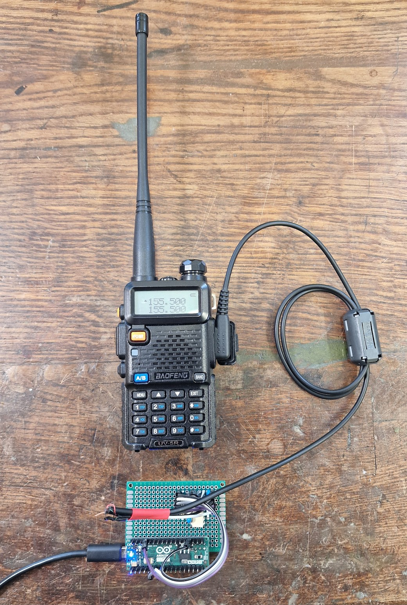

# FoxHunt Transmitter

**Automated Morse Code Transmitter for Baofeng Radios**

This Arduino sketch automates fox hunting (ARDF) transmissions on radios like the Baofeng UV-5R. It outputs a long tone for direction finding, followed by customizable Morse code, with rest periods in between.

## Features

- **Periodic Cycles**: Long tone (default: 10s), Morse message, rest (default: 60s).
- **Customizable**: Message, tone frequency (default: 600 Hz), dit duration (default: 64 ms), durations via serial menu.
- **Hardware Interface**: Audio tones on Pin 5 for mic; PTT control on Pin 7 via 4N25 optocoupler (HIGH to transmit).
- **Persistence**: Settings saved in EEPROM.
- **Morse Timing**: Standard units (dit=1, dah=3, etc.); supports A-Z, 0-9, spaces.
- **Debug**: Built-in LED visualizes code; serial output for startup info.

## Hardware

- Arduino (e.g., Uno/Nano).
- Baofeng UV-5R or similar.
- 4N25 optocoupler for PTT.
- Connections: Pin 7 (PTT), Pin 5 (audio), Pin 13 (LED).

## Installation

1. Open in Arduino IDE (2.3.7+).
2. Upload to board.

## Serial Interface (9600 baud)

Send 'x' during rest to enter menu:
- 1: Set message (e.g., "21M085 FOX").
- 2: Tone Hz.
- 3: Dit ms.
- 4: Rest seconds.
- 5: Long tone seconds.
- 6: Reset defaults.
- x: Exit.

Timeouts: Menu (30s), inputs (10s). Changes saved to EEPROM.
